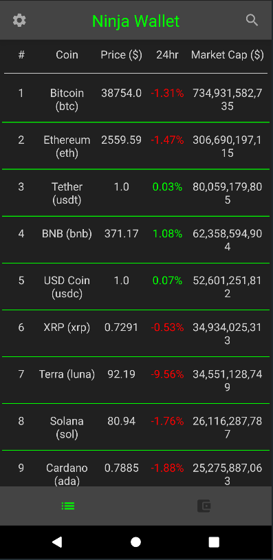
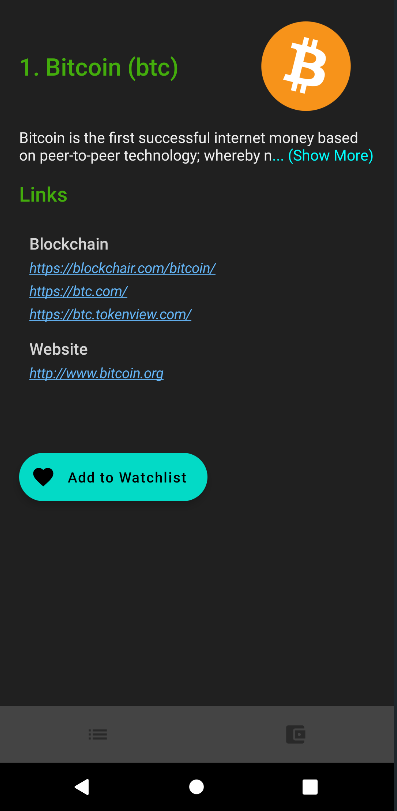
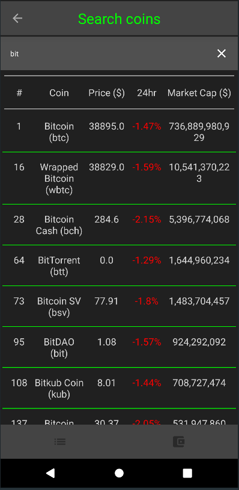

# Ninja-wallet

A cryptocurrency price tracker that uses the Coingecko API to display cryptocurrency prices and price fluctuations.

  
  
  

The app has a settings screen that enables you to change the currency that crypto are measured by and the time frame of the price fluctuations.
There is also a search function for quickly locating your favorite coin.
For each coin there are more informations and links provided by Coingecko API.
Last, you can add coins to your favorite list to be able to easily check their prices.

This app has been made for demonstration reasons. It is also published on both Play Store (Google) and AppGalery (Huawei).

Implementation details:
This app uses the MVVM pattern with CLEAN architecture. It is fully developed on jetpack compose.
Libraries used:
- Jetpack compose and the accompanist library for animated Scaffold features (TopBar hide/show) and "swipe-to-refresh" functionality
- Kotlin coroutines and Flow for asynchronous data fetch
- Dagger - Hilt for dependency injection
- Retrofit for the remote data fetching
- Room database for storing local data
- SharedPreferences are also used for the settings parameters
- Splash screen (Android 12)
- Firebase analytics, crashlytics and performance for monitoring
